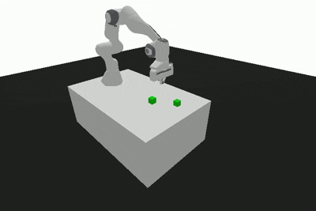

# 🤖 Panda Pick & Place - LLM 驱动的机械臂闭环控制


## 📋 项目介绍


**一个完全由大语言模型 (LLM) 驱动的机械臂自主控制系统**。使用 OpenRouter API 调用多种 LLM 模型（Gemini、Claude、Mistral 等），让大模型通过闭环感知-决策-执行循环来完成 Pick & Place（夹取与放置）任务。

### ✨ 核心特性

- **🧠 LLM 驱动决策** — 大语言模型实时推理和决策，无需预编程的固定策略
- **🔄 完整闭环系统** — 感知 → 决策 → 执行 → 反馈 → 循环
- **🛡️ 工作空间保护** — 自动验证坐标范围，防止机械臂碰撞
- **💡 智能自我纠正** — LLM 根据反馈自动调整策略
- **🔌 多模型支持** — 一行命令切换不同的 LLM 模型（OpenRouter + OpenAI）
- **🎥 视频录制** — 一键录制机械臂操作过程为高质量 MP4 视频
- **🔧 完整工具链** — 诊断工具、自动化脚本、详细文档
- **📊 实时可视化** — PyBullet 仿真环境实时渲染机械臂运动

### 🎯 应用场景

- 🏭 工业自动化控制研究
- 🤖 机器人学习研究
- 🎓 AI 教学示例项目
- 📚 LLM 工具调用 (Function Calling) 演示
- ⚙️ 大模型控制系统原型验证

---

## 🚀 快速开始

### 前置要求

- **Python**: 3.10 或更高版本
- **API Key**: [OpenRouter](https://openrouter.ai) 的 API Key（免费试用可用）
- **系统**: Linux/macOS/Windows (带 WSL)

### 📦 一分钟安装

#### 步骤 1️⃣  - 克隆项目

```bash
git clone https://github.com/tranqui1ity-qaq/robot_agent.git
cd robot_agent
```

#### 步骤 2️⃣  - 创建 Python 虚拟环境

```bash
# 使用 conda（推荐）
conda create -n robot-agent python=3.10
conda activate robot-agent

# 或使用 venv
python -m venv venv
source venv/bin/activate  # Linux/macOS
# venv\Scripts\activate  # Windows
```

#### 步骤 3️⃣  - 安装依赖

```bash
pip install -r requirements.txt
```

**或手动安装：**
```bash
pip install opencv-python panda-gym gymnasium[classic_control] numpy openai
```

#### 步骤 4️⃣  - 配置 API Key

```bash
# 方式 A：设置环境变量（推荐）
export OPENROUTER_API_KEY="sk_your_api_key_here"

# 方式 B：在系统中永久设置
# Linux/macOS: echo 'export OPENROUTER_API_KEY="sk_..."' >> ~/.bashrc
# Windows: 设置环境变量（系统设置 → 高级 → 环境变量）
```

**如何获取 API Key？**
1. 访问 [OpenRouter Dashboard](https://openrouter.ai/keys)
2. 点击 "Create Key"
3. 复制生成的 key

#### 步骤 5️⃣  - 运行项目

```bash
# 方式 A：LLM 模式（推荐）- 使用默认模型运行 50 步
./run_openrouter.sh 50

# 方式 B：LLM 模式 - 直接使用 Python
python main.py --mode llm --max-steps 50 --provider openrouter

# 方式 C：演示模式 - 无需 API Key（硬编码策略）
python main.py --mode demo --max-steps 50

# 方式 D：录制视频 - 将运行过程保存为 MP4
bash record_video.sh robot_demo.mp4 50 20 openrouter 60
```

✅ **完成！** 你应该看到 PyBullet 窗口显示机械臂运动。

## 🎮 使用示例

### 示例 1：运行演示模式（无需 API Key）

```bash
python main.py --mode demo --max-steps 50 --render
```

✅ 输出：完整的 Pick & Place 演示（8 个阶段）

### 示例 2：使用 Gemini 3 运行 LLM 模式

```bash
export OPENROUTER_API_KEY="sk_your_key"
export LLM_MODEL="google/gemini-3-flash-preview"
python main.py --mode llm --max-steps 100 --render
```

### 示例 3：切换到其他 LLM 模型

```bash
# 使用 Claude 3.5 Sonnet
export LLM_MODEL="anthropic/claude-3.5-sonnet"
python main.py --mode llm --max-steps 50

# 使用 Mistral Large
export LLM_MODEL="mistralai/mistral-large"
python main.py --mode llm --max-steps 50

# 使用 Deepseek
export LLM_MODEL="deepseek/deepseek-chat"
python main.py --mode llm --max-steps 50
```

### 示例 4：录制演示视频 🎥 **[NEW]**

```bash
# 基础版 - 使用默认参数（50步，20帧/步，60 FPS）
bash record_video.sh

# 自定义输出文件名
bash record_video.sh my_demo.mp4

# 高质量视频（更多帧，更流畅）
bash record_video.sh high_quality.mp4 50 50 openrouter 60

# 快速演示（较少帧，较小文件）
bash record_video.sh quick.mp4 30 10 openrouter 30

# 使用 OpenAI API 录制
bash record_video.sh demo.mp4 50 20 openai 60
```

📖 詳細说明：[📚 视频录制指南](docs/VIDEO_RECORDING_GUIDE.md)

---

## 📚 项目结构

```
robot_agent/
├── 📄 核心文件
│   ├── env_wrapper.py              ⚙️ 低层机械臂控制（环境包装）
│   ├── skills.py                   🛠️ LLM 可调用的工具函数
│   └── main.py                     🧠 主循环与 LLM 集成
│
├── 🎬 视频录制
│   ├── record_video.py             录制演示视频脚本
│   └── record_video.sh             一键录制启动脚本 [NEW]
│
├── 🚀 启动脚本
│   └── run_openrouter.sh           自动化启动脚本
│
├── 📚 文档 (全部在 docs/ 目录)
│   ├── docs/README.md              📚 文档导航中心 [全新]
│   ├── docs/QUICK_START.md         ⚡ 快速开始指南
│   ├── docs/INSTALLATION.md        📥 详细安装步骤
│   ├── docs/VIDEO_RECORDING_GUIDE.md  🎥 视频录制使用说明 [NEW]
│   ├── docs/LLM_INTEGRATION.md     🤖 LLM 集成指南
│   ├── docs/ARCHITECTURE.md        🔧 系统架构设计
│   ├── docs/PROJECT_GUIDE.md       📖 完整项目讲解
│   ├── docs/TROUBLESHOOTING.md     🐛 故障排查指南
│   └── docs/QUICK_REFERENCE.md     ⚡ 快速参考卡片
│
├── 📦 配置文件
│   ├── requirements.txt            Python 依赖
│   ├── LICENSE                     MIT 许可证
│   └── .gitignore                  Git 忽略规则
│
└── 📹 输出目录（自动创建）
    └── videos/                     录制的 MP4 视频
```

---

## 🔧 配置文件

### requirements.txt

```
opencv-python==4.8.1.78
panda-gym==3.8.2
gymnasium[classic_control]==0.29.1
numpy==1.24.3
openai==1.3.3
```

### 环境变量

| 变量 | 说明 | 示例 |
|------|------|------|
| `OPENROUTER_API_KEY` | OpenRouter API Key（必需） | `sk_live_xxx` |
| `LLM_MODEL` | 要使用的 LLM 模型（可选） | `google/gemini-3-flash-preview` |
| `ROBOT_RENDER` | 是否启用渲染（可选） | `true` / `false` |

---


## 📖 完整文档

所有详细文档都在 **[docs/](docs/)** 目录中，按功能和场景组织：

### 🎯 快速导航

- **🚀 [快速开始](docs/QUICK_START.md)** — 5 分钟快速上手
- **📥 [安装指南](docs/INSTALLATION.md)** — 详细安装步骤（支持 macOS/Linux/Windows/Docker）
- **🎥 [视频录制指南](docs/VIDEO_RECORDING_GUIDE.md)** — 一键录制演示视频 🆕
- **🤖 [LLM 集成指南](docs/LLM_INTEGRATION.md)** — OpenRouter 和 OpenAI 配置
- **🔧 [架构设计](docs/ARCHITECTURE.md)** — 系统架构和模块设计
- **📚 [项目讲解](docs/PROJECT_GUIDE.md)** — 完整功能和源代码讲解
- **🐛 [故障排查](docs/TROUBLESHOOTING.md)** — 常见问题和解决方案
- **⚡ [快速参考](docs/QUICK_REFERENCE.md)** — 命令速查表

👉 **[📚 文档导航中心](docs/README.md)** — 所有文档的索引和使用指南

---

## 🚀 快速命令速查

```bash
# 查看所有命令选项
python main.py --help

# 演示模式（无需 API Key)
python main.py --mode demo --max-steps 50

# LLM 模式（需要 API Key）
python main.py --mode llm --max-steps 50

# 使用启动脚本（推荐）
./run_openrouter.sh 50

# 录制视频（新功能）
bash record_video.sh                                    # 默认参数
bash record_video.sh demo.mp4 50 20 openrouter 60      # 自定义参数

# 后台运行
nohup python main.py --mode llm --max-steps 100 > robot.log 2>&1 &

# 查看并跟踪日志
tail -f robot.log

# 查看所有已录制的视频
ls -lh videos/
```

📚 详见：[⚡ 快速参考](docs/QUICK_REFERENCE.md)

---

<div align="center">

**⭐ 如果本项目对你有帮助，请给个 Star！**

Made with ❤️ by [tranqui1ity](https://github.com/tranqui1ity-qaq)

</div>
